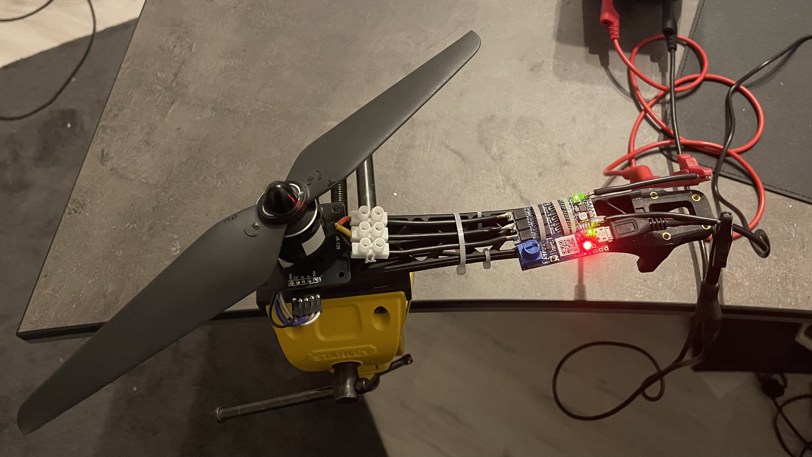

# Motor Control – STM32 B-G431B-ESC1

## Overview
Field-Oriented Control (FOC) implementation for a PMSM using the STM32G431
and the ST B-G431B-ESC1 evaluation board.

## Features
- Field-Oriented Control (Clarke/Park, SVM)
- Cascaded PI current and speed control
- Table-driven state machine
- Encoder-based position and speed estimation (Q16)
- On-device motor parameter identification (work in progress)
- Safety mechanisms (OC/OV/OT, fault handling)

## Hardware
- STM32G431
- B-G431B-ESC1
- Magnetic encoder (ABZ mode)

## Software Architecture
The motor control firmware is structured into functional modules:
- `foc.c` – FOC core (Clarke/Park, inverse transforms)
- `motor_sm.c` – Table-driven state machine
- `motor_task.c` – Real-time task coordination
- `svm.c` – Space Vector Modulation
- `encoder.c` – Position and speed estimation
- `motor_safety.c` – Fault handling and protection


## Build & Flash
- STM32CubeIDE
- GCC ARM
- Tested with B-G431B-ESC1

## Status
Work in progress – some modules (parameter estimation)
are not fully implemented yet.

## License
MIT


## Quickstart Guide

### Assembly

The pins of the electrical encoder are connected to the inputs (J8) on the underside of the B-G431B-ESC1.



### Adjustments

In `parameter.h`, specify the correct number of pulses per revolution.

```C
// ############ ENCODER PARAMETER ######################
#define ENCODER_PULS_PER_REVOLUTION	4096
```

If this value is changed, also update the TIM4 period in `main.c`.
The timer period must be 16 times ENCODER_PULS_PER_REVOLUTION.

```C
htim4.Init.Period = 65535; // -> (16 * 4096)
```

Configure the motor parameters (Rs, Ls, Lambda, J, ...) in `parameter.h`.

### Operation Modes
#### Control By Hand
To control the motor for testing purposes (e.g., via CubeMonitor), the automatic shutdown feature in `settings.h` must be disabled. This feature shuts down the motor for safety reasons if the UART connection to the master is interrupted.

```C
#define AUTOMATIC_SWITCH_OFF			OFF		// stop the motor if losing connection to master (deactivate for debug)
```
The motor states can be controlled by setting the inputs ‘btn_stop_edge’, ‘btn_closed_edge’, ‘btn_open_edge’, and ‘btn_gotostart_edge’. To set a reference speed, the value of ‘g_motor.speed’ must be changed.
```C
/* User Inputs */
extern volatile bool btn_stop_edge;         // STOP
extern volatile bool btn_closed_edge;       // CLOSED LOOP
extern volatile bool btn_open_edge;         // OPEN LOOP
extern volatile bool btn_gotostart_edge;    // GOTO START
```
It is essential that GOTO_START is called once before the motor enters CLOSED_LOOP so that the motor aligns itself with the d-axis.

⚠️ Warning:
Ensure the motor is mechanically secured before enabling CLOSED_LOOP.
Unexpected startup torque may occur.

#### Control via Flight Controller

Motor commands are received via UART as a 4-byte data frame (`RxData[4]`).

##### Frame Structure

| Byte Index | Description |
|------------|------------|
| `RxData[0]` | Header byte (must be `0xFF`) |
| `RxData[1]` | Command byte (Start / Stop) |
| `RxData[2]` | Speed command – High byte (MSB) |
| `RxData[3]` | Speed command – Low byte (LSB) |

---

### Header Byte

The first byte must be `0xFF`.  
If the header is invalid, the frame should be ignored.

---

### Command Byte

The second byte defines whether the motor is started or stopped.

The command values are defined in `communication.h`:

```c
#define MOTOR_STOP   0x00
#define MOTOR_START  0xAA
```

- `0xAA` → Start motor  
- `0x00` → Stop motor  

---

### Speed Command (16-bit signed)

The desired speed is transmitted as a signed 16-bit integer (`int16_t`) split into two bytes:

- `RxData[2]` → Most Significant Byte (MSB)  
- `RxData[3]` → Least Significant Byte (LSB)  

The reconstruction is performed as follows:

```c
communication.speed_command = (int16_t)(RxData[3] | (RxData[2] << 8));
```

#### Explanation

- `RxData[2] << 8` shifts the high byte into the upper 8 bits  
- `RxData[3]` remains in the lower 8 bits  
- The bitwise OR (`|`) merges both bytes  
- Casting to `int16_t` ensures correct signed interpretation  

This reconstructs the original 16-bit signed speed command transmitted by the flight controller.


## Control Loop Configuration

- PWM frequency: 20 kHz  
- Current control loop: 20 kHz  
- Speed control loop: 1 kHz  
- Encoder resolution: 4096 pulses/rev (Q16 position scaling)
## Documentation

A detailed explanation of the FOC implementation and the table-driven state machine
can be found in `/docs`.