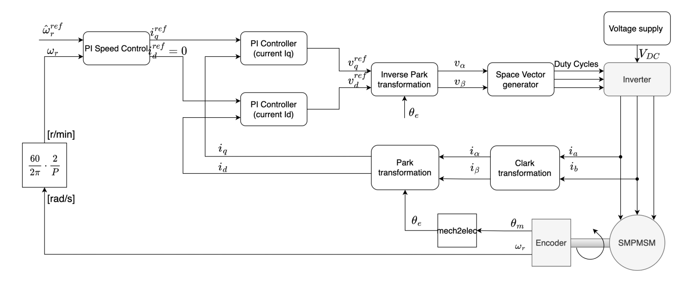
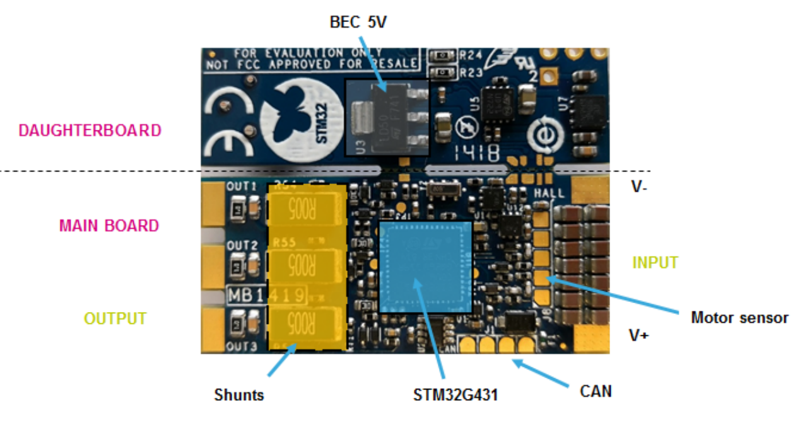

# Field-Oriented Control (FOC) with STM32 B-G431B-ESC1

This project implements Field-Oriented Control (FOC) for PMSM motors using the STM32 B-G431B-ESC1 development board.

## Field-Oriented Control (FOC)

Field-Oriented Control is an advanced motor control technique that provides:
- Precise torque and speed control
- High efficiency
- Smooth operation
- Support for both encoder-based and sensorless operation

## B-G431B-ESC1 Development Board

### Top view

### Bottom view

## Project Structure

### Core Control Files

**[foc.h](./Core/Inc/foc.h) / [foc.c](./Core/Src/foc.c)**
- Main FOC algorithm implementation
- Current regulation & Clarke/Park transformations
- Parameters can be changed and basic settings can be made here

**[control.h](./Core/Inc/control.h) / [control.c](./Core/Src/control.c)**
- PI controllers for current (d/q axis) and speed control
- Includes both floating-point and Q15 fixed-point implementations
- Anti-windup mechanisms

**[svm.h](./Core/Inc/svm.h) / [svm.c](./Core/Src/svm.c)**
- Space Vector Modulation (SVM)
- Calculates the PWM output for the motor phases

### Motor State Machine

**[motor_sm.h](./Core/Inc/motor_sm.h) / [motor_sm.c](./Core/Src/motor_sm.c)**
- Implements a state machine for motor control
- States: STOP, CLOSEDLOOP, OPENLOOP, GOTOSTART, FAULT
- Handles transitions and events

**[motor_types.h](./Core/Inc/motor_types.h)**
- Defines motor states and data structures
- Motor operating modes (closed-loop, open-loop, sensorless)

**[motor_events.h](./Core/Inc/motor_events.h)**
- Event flags for motor control (faults, user inputs)

**[motor_task.h](./Core/Inc/motor_task.h) / [motor_task.c](./Core/Src/motor_task.c)**
- Time management for motor control tasks
- Frequency dividers for different task rates

### Sensing and Feedback

**[encoder.h](./Core/Inc/encoder.h) / [encoder.c](./Core/Src/encoder.c)**
- Position and speed determination by reading encoder values
- Used in closed-loop control mode

**[observer.h](./Core/Inc/observer.h) / [observer.c](./Core/Src/observer.c)**
- Sensorless observer implementation
- State estimation without encoder

**[current_measurement.h](./Core/Inc/current_measurement.h) / [current_measurement.c](./Core/Src/current_measurement.c)**
- Calculates motor currents by reading ADC values
- Phase current reconstruction

### Safety and Protection

**[motor_safety.h](./Core/Inc/motor_safety.h) / [motor_safety.c](./Core/Src/motor_safety.c)**
- Motor safety mechanisms

**[overcurrent_overvoltage_protection.h](./Core/Inc/overcurrent_overvoltage_protection.h) / [overcurrent_overvoltage_protection.c](./Core/Src/overcurrent_overvoltage_protection.c)**
- Hardware protection features
- Overcurrent and overvoltage detection

### Auxiliary Files

**[foc_math.h](./Core/Inc/foc_math.h) / [foc_math.c](./Core/Src/foc_math.c)**
- Math functions for FOC calculations
- Look-up tables for trigonometric functions
- Fixed-point arithmetic utilities

**[task.h](./Core/Inc/task.h) / [task.c](./Core/Src/task.c)**
- Main task scheduler
- Coordinates program sequence and status

**[communication.h](./Core/Inc/communication.h) / [communication.c](./Core/Src/communication.c)**
- Communication interface
- Data logging and debugging

**[parameter.h](./Core/Inc/parameter.h)**
- Motor and system parameters
- Configuration constants

**[settings.h](./Core/Inc/settings.h)**
- System-wide settings

**[stm32g4xx_it.h](./Core/Inc/stm32g4xx_it.h) / [stm32g4xx_it.c](./Core/Src/stm32g4xx_it.c)**
- Interrupt handlers
- TIM1_UP_TIM16_IRQHandler triggers the FOC algorithm at high frequency

## Control Architecture

### Current Control Loop
The current control loop is designed using the **technical optimum tuning method**, where the transfer function of the controlled system is configured as a first-order low-pass filter. The controller settings for the inner current control loop are set according to **magnitude optimum**.

### Speed Control Loop
The controller parameters for the outer speed control loop are set according to the **symmetrical optimum** tuning method.

## Motor States

The motor control system operates in the following states:

- **STOP**: Motor is stopped, no PWM output
- **CLOSEDLOOP**: FOC with speed control using encoder feedback
- **OPENLOOP**: Open-loop control mode
- **GOTOSTART**: Motor startup sequence
- **FAULT**: Error state triggered by overcurrent or other faults

## References

Control of Electric Machine Drive Systems | Wiley Online Books. https://onlinelibrary.wiley.com/doi/book/10.1002/9780470876541 (Accessed on 08/06/2022)
