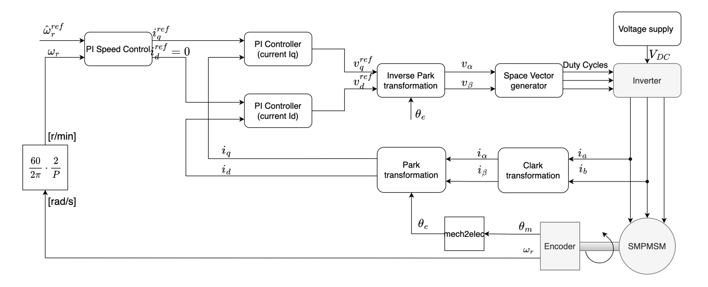

# Field-Oriented Control (FOC) mit STM32 B-G431B-ESC1 

## Übersicht der Quellcode-Module

Die Motorsteuerung ist in mehrere funktionale Module aufgeteilt: **foc.c** implementiert die feldorientierte Regelung mit Clarke- und Park-Transformationen, **control.c** enthält die kaskadierten PI-Regler für Strom und Geschwindigkeit (nach technischem und symmetrischem Optimum), **motor_sm.c** verwaltet die tabellengetriebene Zustandsmaschine für die verschiedenen Betriebszustände, und **motor_task.c** koordiniert die zeitkritischen Regelschleifen auf verschiedenen Prioritätsebenen. **svm.c** erzeugt die PWM-Signale mittels Space-Vector-Modulation, **current_measurement.c** erfasst und verarbeitet die Phasenströme über ADC/DMA, **encoder.c** liefert Positions- und Geschwindigkeitsinformationen, **observer.c** ermöglicht Zeitmessungen der Regelung. **motor_safety.c** implementiert Sicherheitsfunktionen wie automatisches Abschalten bei Verbindungsverlust, **motor_param_est.c** führt die automatische Motorparameteridentifikation durch, **communication.c** steuert die UART-Kommunikation für Datenübertragung und Befehle, und **overcurrent_overvoltage_protection.c** überwacht kritische Grenzwerte. Die Hilfsmodule **motor_ctrl.c**, **motor_events.c**, **motor_types.c** und **foc_math.c** stellen gemeinsame Datenstrukturen, Eventhandling und optimierte Festkomma-Mathematikfunktionen bereit.


### Übersicht FOC

#### Park & Clarke Transformation

Die **Field Oriented Control (FOC)** basiert darauf, die dreiphasigen Motorströme in ein geeignetes Koordinatensystem zu transformieren, sodass Fluss- und Drehmomentanteil unabhängig voneinander geregelt werden können. Die Abbildung zeigt beispielhaft den Vektor $f$, der in den drei relevanten Koordinatensystemen $abc$, $\alpha\beta$ und $dq$ dargestellt ist.


Mithilfe der **Clarke-Transformation** werden die um $120^\circ$ phasenverschobenen Ströme des dreiphasigen Systems in ein zweidimensionales stationäres Koordinatensystem überführt. Dabei erfolgt eine Aufteilung in den Realteil $\alpha$ und den Imaginärteil $\beta$. 
$$
\mathbf{f}_{\alpha\, \beta} 
		= f_\alpha + j f_\beta 
		\;\;\  \equiv\;\; 
		\frac{2}{3}\left[ f_a + e^{j\frac{2\pi}{3}} f_b + e^{j\frac{4\pi}{3}} f_c \right] \\
		\begin{bmatrix}
			f_{\alpha} \\[4pt]
			f_{\beta}
		\end{bmatrix}
		=
		\frac{2}{3}
		\begin{bmatrix}
			1 & -\tfrac{1}{2} & -\tfrac{1}{2} \\
			0 & \tfrac{\sqrt{3}}{2} & -\tfrac{\sqrt{3}}{2}
		\end{bmatrix}
		\begin{bmatrix}
			f_a \\[4pt]
			f_b \\[4pt]
			f_c
		\end{bmatrix}
$$
Da die Größen im $\alpha\beta$-System weiterhin zeitvariant sind, wird anschließend die **Park-Transformation** angewendet. Hierbei wird das Koordinatensystem um den elektrischen Winkel \theta_e rotiert, sodass es mit dem Raumzeiger f mitrotiert. Dadurch entstehen die Komponenten im rotierenden $dq$-Koordinatensystem.
$$
\mathbf{f}_{d\,q} 
		= \mathbf{f}_{\alpha \, \beta} \cdot e^{-\theta _e}\\
\begin{bmatrix}
	f_d \\[4pt]
	f_q
\end{bmatrix}
=
\begin{bmatrix}
	\cos\theta_e & \sin\theta_e \\
	-\sin\theta_e & \cos\theta_e
\end{bmatrix}
\begin{bmatrix}
	f_\alpha \\[4pt]
	f_\beta
\end{bmatrix}
$$
Die Clarke- und Park-Transformation besitzen jeweils eine inverse Transformation, mit der die berechneten Spannungs- oder Stromgrößen aus dem $dq$-Koordinatensystem wieder in das stationäre $\alpha\beta$-System und anschließend in das dreiphasige abc-System transformiert werden können.

Durch diese Transformation werden die ursprünglich sinusförmigen Größen in nahezu konstante Größen überführt, wodurch eine entkoppelte Regelung von Fluss- (d-Achse) und Drehmomentanteil (q-Achse) ermöglicht wird.


#### **Inverse Park & Clarke -Transformation**

Die inverse Park-Transformation rotiert den Vektor aus dem rotierenden dq-Koordinatensystem zurück in das stationäre \alpha\beta-Koordinatensystem. Dabei wird um den elektrischen Winkel \theta_e in entgegengesetzter Richtung zur Park-Transformation rotiert:


$$
\begin{bmatrix} f_{\alpha} \\ f_{\beta} \end{bmatrix} = \begin{bmatrix} \cos \theta_e & -\sin \theta_e \\ \sin \theta_e & \cos \theta_e \end{bmatrix} \begin{bmatrix} f_d \\ f_q \end{bmatrix}
$$


Anschließend werden die Größen aus dem stationären \alpha\beta-Koordinatensystem wieder in das dreiphasige abc-System transformiert:


$$
\begin{bmatrix} f_a \\ f_b \\ f_c \end{bmatrix} = \begin{bmatrix} 1 & 0 \\ -\frac{1}{2} & \frac{\sqrt{3}}{2} \\ -\frac{1}{2} & -\frac{\sqrt{3}}{2} \end{bmatrix} \begin{bmatrix} f_{\alpha} \\ f_{\beta} \end{bmatrix}
$$


##### Implementierung im Code 

Die Gleichungen werden in der Implementierung mittels effizienter Fixed-Point-Arithmetik (Q15) umgesetzt, wobei Multiplikationen und Skalierungen über Bit-Shift-Operationen realisiert werden.

```c
static alphabeta_t clark_transformation_q15(ab_t Input){
	alphabeta_t Output;
	int32_t x,a,b;

	Output.alpha = Input.a;
	a = (int32_t)Input.a;
	b = (int32_t)Input.b;

	x = (b << 1) + a;
	x = (x >> 2);			// (1) rightshift 15 bits: split in two shifts
	x *= DIV_1_SQRT3_Q15;
	x = (x >> 13);		// (2)
	Output.beta = CLAMP_INT32_TO_INT16(x);

	return (Output);
}
```


```c
static dq_t park_transformation_q15(alphabeta_t I, angle_t el_theta){

	dq_t Output;

	int32_t x;
	x		= ((int32_t)el_theta.cos * (int32_t)I.alpha) + ((int32_t)el_theta.sin * (int32_t)I.beta);
	x		= (x >> 15);
	Output.d = CLAMP_INT32_TO_INT16(x);

	x		= (-(int32_t)el_theta.sin * (int32_t)I.alpha) + ((int32_t)el_theta.cos * (int32_t)I.beta);
	x		= (x >> 15);
	Output.q = CLAMP_INT32_TO_INT16(x);

	return (Output);
}
```




Der Strom Regelkreis wird mit der tuning method des technischen Optimums erstellt, bei der die Übertragungsfunktion des geregelten Systems als die eines Tiefpassfilter erster Ordnung eingestellt wird.


Nachzulesen bei [1].

[1] Control of Electric Machine Drive Systems | Wiley Online Books. https://onlinelibrary.wiley.com/doi/book/10.1002/ 9780470876541, . – (Accessed on 08/06/2022)


## Automat


### Zustandsautomat für die Motorsteuerung

(Ich habe mich bei meinem Aufbau an https://www.codeproject.com/articles/State-Machine-Design-in-C#comments-section orientiert.)

Der Zustandsautomat der Motorsteuerung ist als tabellengetriebene Zustandsmaschine mit einem kleinen Kernel aufgebaut. Die Struktur `SM_StateMachine` kapselt den aktuellen Zustand und die zugehörige Motorinstanz:

```c
typedef struct SM_StateMachine {
    Motor*  m;
    uint8_t currentState;
    uint8_t newState;
    bool    eventGenerated;
    void*   pEventData;
} SM_StateMachine;
```

`currentState` enthält den aktiven Zustand, `newState` wird bei einem Übergang gesetzt, und `eventGenerated` signalisiert dem Kernel, dass ein internes Ereignis zur Abarbeitung ansteht. Über den Zeiger `m` greifen die Zustandsfunktionen direkt auf die zugehörige `Motor`‑Instanz zu.

Beim Initialisieren der Zustandsmaschine wird der Motor in einen sicheren Startzustand überführt:

```c
void MotorSM_Init(Motor* m)
{
    sm.m              = m;
    sm.currentState   = ST_STOP;
    sm.newState       = ST_STOP;
    sm.eventGenerated = false;
    sm.pEventData     = NULL;

    /* sicherer Start: in STOP gehen */
    SM_ExternalEvent(&sm, MotorStateMap, ST_MAX, ST_STOP, NULL);
}
```

### Zustände und State‑Map

Die möglichen Zustände des Automaten sind im `MotorState`‑Enum definiert:

```c
typedef enum {
    ST_STOP = 0,
    ST_CLOSEDLOOP,
    ST_OPENLOOP,
    ST_GOTOSTART,
    ST_PARAMETER_ID,
    ST_FAULT,
    ST_MAX
} MotorState;
```

Zu jedem Zustand existiert ein eigener State‑Handler:

```c
static void State_Stop(SM_StateMachine* self, void* eventData);
static void State_ClosedLoop(SM_StateMachine* self, void* eventData);
static void State_OpenLoop(SM_StateMachine* self, void* eventData);
static void State_GotoStart(SM_StateMachine* self, void* eventData);
static void State_ParameterId(SM_StateMachine* self, void* eventData);
static void State_Fault(SM_StateMachine* self, void* eventData);
```

Diese Funktionen werden in einer State‑Map zusammengefasst:

```c
static const SM_StateStruct MotorStateMap[ST_MAX] = {
    [ST_STOP]        = { State_Stop },
    [ST_CLOSEDLOOP]  = { State_ClosedLoop },
    [ST_OPENLOOP]    = { State_OpenLoop },
    [ST_GOTOSTART]   = { State_GotoStart },
    [ST_PARAMETER_ID]= { State_ParameterId },
    [ST_FAULT]       = { State_Fault }
};
```

Der Kernel ruft die jeweilige Zustandsfunktion ausschließlich über diese Tabelle auf. Die Implementierungen selbst sind bewusst schlank gehalten und setzen nur die relevanten Felder der Motorstruktur. Beispiel für den Stoppzustand:

```c
static void State_Stop(SM_StateMachine* self, void* eventData)
{
    (void)eventData;
    Motor* m = SM_GetMotor();

    m->state     = ST_STOP;
    m->speed_ref = 0;
}
```

Weitere Zustände setzen analog lediglich das logische Zustandsfeld:

```c
static void State_ClosedLoop(SM_StateMachine* self, void* eventData)
{
    Motor* m = SM_GetMotor();
    m->state = ST_CLOSEDLOOP;
}

static void State_Fault(SM_StateMachine* self, void* eventData)
{
    (void)eventData;
    Motor* m = SM_GetMotor();
    m->state     = ST_FAULT;
    m->speed_ref = 0;
}
```

### Mini‑Kernel: interne und externe Ereignisse

Der Kern der Zustandsmaschine besteht aus einer internen Ereignisfunktion und einer Ausführungsfunktion. Interne Ereignisse planen einen Zustandswechsel:

```c
static void SM_InternalEvent(SM_StateMachine* self, uint8_t newState, void* eventData)
{
    self->newState       = newState;
    self->pEventData     = eventData;
    self->eventGenerated = true;
}
```

Die eigentliche Abarbeitung erfolgt in der State‑Engine:

```c
static void SM_StateEngine(SM_StateMachine* self,
                           const SM_StateStruct* stateMap,
                           uint8_t maxStates)
{
    while (self->eventGenerated)
    {
        self->eventGenerated = false;
        self->currentState   = self->newState;

        if (self->currentState >= maxStates) {
            return;
        }

        SM_StateFunc f = stateMap[self->currentState].fn;
        if (f == NULL) {
            return;
        }

        f(self, self->pEventData);
    }
}
```

Solange `eventGenerated` gesetzt ist, übernimmt die Engine den neuen Zustand, prüft die Gültigkeit und ruft schließlich die zugehörige Zustandsfunktion aus der State‑Map auf. Dadurch können auch Kaskaden von internen Ereignissen abgearbeitet werden.

Die Funktion `SM_ExternalEvent` stellt die Schnittstelle nach außen dar und filtert Sonderfälle:

```c
static void SM_ExternalEvent(SM_StateMachine* self,
                             const SM_StateStruct* stateMap,
                             uint8_t maxStates,
                             uint8_t newState,
                             void* eventData)
{
    if (newState == EVENT_IGNORED) {
        return;
    }
    if (newState == CANNOT_HAPPEN) {
        /* assert/log */
        return;
    }
    if (newState >= maxStates) {
        /* assert/log */
        return;
    }

    SM_InternalEvent(self, newState, eventData);
    SM_StateEngine(self, stateMap, maxStates);
}
```

Unerlaubte oder explizit ignorierte Übergänge werden hier verworfen. Nur gültige Zustandswechsel werden als internes Ereignis an die Engine weitergegeben.

### Ereignisfunktionen und Übergangstabellen

Die öffentlichen API‑Funktionen (`MTR_Stop`, `MTR_RunClosedLoop` usw.) repräsentieren die externen Ereignisse des Automaten. Für jedes Ereignis existiert eine Übergangstabelle, die vom aktuellen Zustand auf den Folgezustand abbildet. Beispiel für das Stopp‑Ereignis:

```c
void MTR_Stop(Motor* m)
{
    (void)m;
    static const uint8_t TRANSITIONS[ST_MAX] = {
        [ST_STOP]        = EVENT_IGNORED,
        [ST_CLOSEDLOOP]  = ST_STOP,
        [ST_OPENLOOP]    = ST_STOP,
        [ST_GOTOSTART]   = ST_STOP,
        [ST_PARAMETER_ID]= ST_STOP,
        [ST_FAULT]       = CANNOT_HAPPEN
    };

    uint8_t next = TRANSITIONS[sm.currentState];
    SM_ExternalEvent(&sm, MotorStateMap, ST_MAX, next, NULL);
}
```

Für das Ereignis „RunClosedLoop“ sieht die Tabelle entsprechend anders aus:

```c
void MTR_RunClosedLoop(Motor* m)
{
    (void)m;
    static const uint8_t TRANSITIONS[ST_MAX] = {
        [ST_STOP]        = ST_CLOSEDLOOP,
        [ST_CLOSEDLOOP]  = EVENT_IGNORED,
        [ST_OPENLOOP]    = ST_CLOSEDLOOP,
        [ST_GOTOSTART]   = EVENT_IGNORED,
        [ST_PARAMETER_ID]= EVENT_IGNORED,
        [ST_FAULT]       = CANNOT_HAPPEN
    };

    uint8_t next = TRANSITIONS[sm.currentState];
    SM_ExternalEvent(&sm, MotorStateMap, ST_MAX, next, NULL);
}
```

Damit ist das komplette Übergangsverhalten des Automaten in kompakten Tabellen beschrieben, anstatt in verschachtelten `if`‑ oder `switch`‑Strukturen. Unerlaubte Übergänge werden über `CANNOT_HAPPEN` markiert, ignorierte Ereignisse über `EVENT_IGNORED`.

### Anbindung an die Motor‑Logik

Die zyklische Service‑Funktion `MotorSM_Service` koppelt physikalische Ereignisse (Flags, Taster, Schutzfunktionen) an die abstrakten Zustandsereignisse des Automaten:

```c
void MotorSM_Service(Motor* m)
{
    if (oc_trip || ot_trip || ov_trip) {
        MTR_Fault(m);
        return;
    }
    if(m->stop_request_flag){
        m->stop_request_flag = false;
        m->start_request_flag = false;
        MTR_Stop(m);
        return;
    }
    if(m->recive_command_flag){
        m->recive_command_flag = false;
        m->speed_ref = get_speed_command();
    }

    if(m->start_request_flag){
        m->start_request_flag = false;
        MTR_RunClosedLoop(m);
    }
    if(m->gotostart_finish_flag){
        // m->gotostart_finish_flag = false; <-- do not reset here
        MTR_Stop(m);
    }

    if (btn_stop_edge) {
        btn_stop_edge = false;
        MTR_Stop(m);
    }
    if (btn_parameter_id_edge) {
        btn_parameter_id_edge = false;
        MTR_ParameterId(m);
    }

    if (btn_closed_edge) {
        btn_closed_edge = false;
        MTR_RunClosedLoop(m);
    }

    if (btn_open_edge) {
        btn_open_edge = false;
        MTR_RunOpenLoop(m);
    }

    if (btn_gotostart_edge) {
        btn_gotostart_edge = false;
        MTR_GotoStart(m);
    }
}
```

Interne Flags (`start_request_flag`, `stop_request_flag`, `gotostart_finish_flag`), Schutzereignisse (`oc_trip`) und Tasterflanken (`btn_*_edge`) werden hier auf die entsprechenden API‑Funktionen (`MTR_*`) abgebildet. Der Zustandsautomat selbst arbeitet ausschließlich mit diesen abstrakten Ereignissen und bleibt dadurch unabhängig von den konkreten Eingangssignalen.


## Parameter Schätzverfahren

Die Parameterschätzung wird durch das setzen von 'btn_parameter_id_edge' gestartet. Dabei werden die Werte für $R$, $L$, $K_e$ und $J$ der Reihe nach ermittelt. Sollte ein Verfahren fehl schlagen wird die Schätzung abgebrochen und muss von neuem gestartet werden.


### Automatische Rs-Schätzung (Statorwiderstand)

Die Funktion `resistor_measurement_timing()` schätzt den Statorwiderstand `Rs` automatisch, indem mehrere d-Achsen-Stromstufen injiziert und die zugehörigen d-Achsen-Spannungswerte ausgewertet werden. Die Implementierung ist als Zustandsmaschine aufgebaut (`MEASUREMENT` → `CALCULATION`).

---

#### 1) Messphase (MEASUREMENT)

- Es wird bewusst kein Drehmoment angefordert:
  I_ref_q15.q = 0
- Der d-Strom wird stufenweise gesetzt:
  I_ref_q15.d = estimation_t.current_injection_q15[step]
- Die aktive Stromstufe wird über den Zeit-/Schrittzähler bestimmt:
  step = counter_Rs / time_div_Rs

Um Einschwingeffekte zu vermeiden, wird pro Stufe erst nach einer kurzen Einschwingphase gemessen. Anschließend werden bis zu 100 Samples des Reglerausgangs V_dq_q15.d aufsummiert:

  estimation_t.med_voltage_Rs[step] += pHandle_foc->V_dq_q15.d
  estimation_t.mini_counter_Rs[step]++

Nach Abarbeitung aller 6 Stromstufen werden die Spannungen pro Stufe gemittelt.

---

#### 2) Spannungsskalierung (Q15 → Volt)

V_dq_q15.d liegt im Q15-Format (normiert) vor. Zur Umrechnung in eine physikalische Spannung wird skaliert mit:

  ``med_voltage_Rs[i] = (med_voltage_Rs[i] * source_voltage) >> 15``

Wobei  `source_voltage` die vom Board gemessene Quellenspannung im Q10 Format ist. Statt direkt die Spannung zu halbieren (Vdc/2) wird das zum schluss mit 

estimation_t.est_Rs = estimation_t.est_Rs * 0.5f

für eine bessere Auflösung Realisiert.

---

#### 3) Auswertung (CALCULATION)

Nach Abschluss aller Messstufen werden die Stromreferenzen zurückgesetzt:

  I_ref_q15.d = 0
  I_ref_q15.q = 0

Anschließend wird Rs über eine lineare Regression aus den Messpaaren (Id, Vd) bestimmt:

 ``estimation_t.est_Rs = lin_reg(estimation_t.current_injection_q15, estimation_t.med_voltage_Rs, 6)``

Die Regression nutzt den stationären Zusammenhang:

  V_d ≈ R_s · I_d

Durch mehrere Stromstufen ist die Schätzung robuster gegenüber Offset, Quantisierung und Messrauschen als eine Einzelpunktmessung.

---

#### 4) Regressionsfunktion lin_reg()

Die Funktion berechnet die Steigung einer Ausgleichsgeraden durch den Ursprung:

  m = Σ(x_i · y_i) / Σ(x_i²)

Im Kontext der Rs-Schätzung gilt:

  m ≈ R_s

Da sowohl Zähler als auch Nenner denselben Q-Skalierungsfaktor besitzen, hebt sich dieser im Quotienten auf und es kann direkt ein Float-Wert zurückgegeben werden:

  return (float)sum_xy / (float)sum_xx


### Induktivitätsschätzung (Ls) mittels Hochfrequenzinjektion (HFI)


#### Ziel
Bestimmung der Statorinduktivität **Ls** durch Einspeisung eines kleinen hochfrequenten Spannungssignals. Während der Messung wird angenommen, dass sich der Rotor im Stillstand befindet, sodass die Gegen-EMK vernachlässigt werden kann.

#### Messprinzip
Es wird eine sinusförmige Spannung in die **d-Achse** injiziert:

\[
v_d(t) = \hat{V}\sin(\omega t), \quad v_q(t)=0
\]

Für einen stehenden Motor und kleine Signalamplituden kann das elektrische Verhalten näherungsweise durch ein **RL-Impedanzmodell** beschrieben werden:

\[
Z(j\omega) = R_s + j\omega L_s
\]

Der Betrag der Impedanz ergibt sich zu

\[
|Z| = \sqrt{R_s^2 + (\omega L_s)^2}
\]

Mit der gemessenen Stromantwortamplitude \(\hat{I}\) und der bekannten injizierten Spannungsamplitude \(\hat{V}\) ergibt sich:

\[
\frac{\hat{V}}{\hat{I}} = |Z|
\quad\Rightarrow\quad
L_s = \frac{1}{\omega}\sqrt{\left(\frac{\hat{V}}{\hat{I}}\right)^2 - R_s^2}
\]

Um die Robustheit der Schätzung zu erhöhen, wird die Messung bei mehreren Injektionsfrequenzen durchgeführt und die resultierenden Induktivitätswerte anschließend gemittelt.

#### Demodulation der Stromantwort (I/Q-Extraktion)

Das injizierte Signal (\(\sin\) und \(\cos\) der Injektionsfrequenz) ist bekannt. Dadurch kann der gemessene d-Achsenstrom \(i_d\) synchron demoduliert werden:

\[
I = i_d \cdot \sin(\omega t), \qquad Q = i_d \cdot \cos(\omega t)
\]

Nach Anwendung eines Tiefpassfilters auf \(I\) und \(Q\) wird der Betrag der Stromantwort berechnet:

\[
\hat{I} = \sqrt{I^2 + Q^2}
\]

Durch diese synchrone Demodulation wird die Trägerfrequenz entfernt und eine **DC-Schätzung der Stromamplitude** erhalten (vergleichbar mit einem Lock-In-Verstärker).

#### Implementierungsübersicht (`induction_measurement_timing`)

1. **Injektionsfrequenzen:**  
   Drei Frequenzen werden nacheinander verwendet:
   
   - 800 Hz  
   - 1000 Hz  
   - 1200 Hz  

2. **Pro Frequenzschritt:**

   - Berechnung des Winkelinkrements der Injektion aus der Frequenz
   - Einspeisung der Spannung  
     
     \[
     v_d = \hat{V}\sin(\omega t), \quad v_q = 0
     \]

   - Synchrone Demodulation des gemessenen Stroms mittels Sinus und Cosinus (I/Q-Demodulation)
   - Tiefpassfilterung der demodulierten Signale
   - Berechnung der Stromamplitude  
     
     \[
     \hat{I} = \sqrt{I^2 + Q^2}
     \]

   - Mittelwertbildung über mehrere Messwerte innerhalb eines Zeitfensters, um eine stabile Stromamplitude zu erhalten

3. **Berechnung der Induktivität**

   Für jede Injektionsfrequenz wird zunächst

   \[
   \frac{V}{I}
   \]

   berechnet und anschließend

\[
L_s = \frac{1}{\omega}\sqrt{\left(\frac{V}{I}\right)^2 - R_s^2}
\]

   bestimmt.

   Ungültige Messungen (z. B. negativer Ausdruck unter der Wurzel) werden verworfen.

4. **Mittelwertbildung**

   Die final geschätzte Induktivität ergibt sich aus dem Mittelwert aller gültigen Einzelmessungen.

#### Voraussetzungen und Annahmen

- Der Rotor befindet sich während der Messung im Stillstand sodass die Gegen-EMK vernachlässigt werden kann.
- Die Injektionsamplitude ist klein genug, um das System im **linearen Bereich** zu betreiben.
- Der Statorwiderstand \(R_s\) wurde zuvor bestimmt und wird für die Berechnung von \(L_s\) verwendet.
- Die Abtastrate der Strommessung (FOC-Interrupt) ist ausreichend hoch, um die Stromantwort der Injektionsfrequenz zuverlässig zu erfassen.

#### Ergebnis

Die geschätzte Induktivität wird gespeichert in

- `result->Ls_h` (in Henry)

und anschließend in die Motorparameterstruktur übernommen:

- `ctrl.motor_params.Ls`

Nach erfolgreicher Schätzung werden die **PI-Reglerparameter** neu berechnet.


### Gegen-EMK-Konstante (Ke) Schätzung über stationären Betrieb

#### Ziel
Bestimmung der Gegen-EMK-Konstante **Ke** bei **konstanter, niedriger Drehzahl**. Die Schätzung basiert auf dem stationären Spannungsmodell in der q-Achse und verwendet gemittelte Messwerte, um Ripple und Reglerrauschen zu reduzieren.

#### Messprinzip (stationäre Näherung)
Für eine PMSM gilt im dq-System (q-Achse):

\[
v_q = R_s i_q + \omega_e \lambda + L_q \frac{di_q}{dt} + \omega_e L_d i_d
\]

Unter den Messbedingungen

- konstante Drehzahl (stationär)
- \(\frac{di_q}{dt} \approx 0\)
- \(i_d \approx 0\)

vereinfacht sich die Gleichung zu

\[
v_q \approx R_s i_q + \omega_e \lambda
\]

Mit \(\omega_e = p\cdot \omega_m\) (Polpaarzahl \(p\)) folgt:

\[
\lambda \approx \frac{v_q - R_s i_q}{\omega_e}
\]

In dieser Implementierung wird Ke als Spannungskonstante bezogen auf **Drehzahl in rpm** ermittelt. Dazu wird der Term \((v_q - R_s i_q)\) durch die mechanische Drehzahl geteilt und mit der Polpaarzahl skaliert:

\[
K_e \;[\mathrm{V/rpm}] \approx p\cdot \frac{v_q - R_s i_q}{n}
\]

wobei \(n\) die Drehzahl in rpm ist.

> Hinweis: Die genaue physikalische Interpretation hängt davon ab, wie \(v_q\) im Projekt skaliert ist (z. B. Bezug auf \(V_{dc}\), SVPWM-Skalierung, Phasen-/Leiter-Leiter-Spannung). Für eine konsistente Verwendung muss dieselbe Definition in der gesamten Reglerauslegung genutzt werden.

#### Implementierungsdetails (`CALCULATION`)
Im Zustand `CALCULATION` werden die gemittelten Größen rückskaliert und Ke berechnet:

1. **Rückskalierung**
   - q-Achsen-Spannung:
     \[
     V_q = \frac{\overline{v_{q,\mathrm{q15}}}\cdot \frac{1}{2}V_{dc}}{Q10}
     \]
   - q-Achsen-Strom:
     \[
     I_q = \frac{\overline{i_{q,\mathrm{q15}}}}{Q10}
     \]
   - Drehzahl in rpm:
     \[
     n = \frac{\overline{\omega_{\mathrm{q15}}}\cdot n_{\max}}{Q15}
     \]

2. **Numerische Absicherung**
   Sehr kleine Drehzahlen werden verworfen, um Division durch (nahezu) Null und damit unrealistisch große Ke-Werte zu vermeiden:

\[
|n| < 0.1 \;\Rightarrow\; \text{Fehler / Abbruch}
\]

3. **Ke-Berechnung**
\[
K_e = p\cdot \frac{V_q - R_s I_q}{n}
\]

#### Ergebnis
Das Ergebnis wird in der Ergebnisstruktur abgelegt als:

- `result->Ke_vrpm` (Einheit: V/rpm)

und kann anschließend für die Reglerparametrierung bzw. Modellbildung verwendet werden.


## Positionsbestimmung mittels magnetischem Encoder

Zur Erfassung der Rotorposition wird ein magnetischer Encoder vom Typ MT6701 verwendet, der im ABZ-Modus betrieben wird. Die Positionsinformation wird über zwei phasenversetzte Inkrementalsignale (A und B) bereitgestellt. Aus der Reihenfolge der Flanken (A vor B oder B vor A) lässt sich die Drehrichtung bestimmen.

Die A- und B-Signale werden mithilfe eines Hardware-Timers im Encoder-Modus ausgewertet. Abhängig von der Drehrichtung wird der Zählerstand des Timers inkrementiert oder dekrementiert. Wird die Periodendauer (Auto-Reload-Wert) des Timers auf die Auflösung des Encoders eingestellt, entspricht der aktuelle Zählerwert – bei bekanntem Startwinkel – direkt dem mechanischen Rotorwinkel.


#### Winkelrepräsentation in 16-Bit-Festkommadarstellung

Die Rotorposition wird als 16-Bit-Zahl dargestellt. Dabei kann sowohl ein vorzeichenloser (`uint16_t`) als auch ein vorzeichenbehafteter (`int16_t`) Datentyp verwendet werden, da beide binärtechnisch identisch sind. Der Wertebereich wird zyklisch auf den Winkelbereich von 0° bis 360° abgebildet.

Ein wesentlicher Vorteil dieser Darstellung ist, dass der natürliche Überlauf des 16-Bit-Zählers einer kontinuierlichen Winkeldarstellung entspricht. Dadurch lassen sich Winkeloperationen wie Differenzbildung oder Skalierung effizient und ohne zusätzliche Modulo-Operationen implementieren, was insbesondere für zeitkritische Regelalgorithmen vorteilhaft ist.

Bei hohen Drehzahlen in Kombination mit hohen Abtastraten kann es jedoch zu scheinbaren Ausreißern bei der Differenzierung kommen (beim Übergang von `UINT16_MAX` zu `0` beziehungsweise von `+INT16_MAX` zu `-INT16_MAX` ). 

#### Trick: Zählerraum vergrößern (16× Overscaling)

Um auch bei hohen Drehzahlen stabile Geschwindigkeitswerte zu erhalten, wird der Zählerbereich des Timers bewusst vergrößert. Der verwendete Encoder liefert in der Praxis eine periodische Positionsgröße mit einer effektiven Maximalzählzahl von etwa \(N_\text{enc}\approx 4000\) (je nach Betriebsmodus/Initialisierung kann dieser Standardwert auftreten).

Statt den Auto-Reload-Wert (ARR) von TIM4 direkt auf \(N_\text{enc}-1\) zu setzen, wird der Timer auf das 16-Fache skaliert:

\[
ARR = 16\cdot N_\text{enc} - 1 \approx 16\cdot 4000 - 1 = 63999
\]

Damit wird die Winkelrepräsentation „aufgespreizt“ (höhere interne Auflösung), und die Differenzbildung über den periodischen Überlauf wird deutlich unempfindlicher. In der Praxis führt das zu wesentlich saubereren Drehzahlschätzungen bei hohen Drehzahlen.


Die Funktion `calc_rotor_position()` liest den aktuellen Zählerstand des Encoders aus dem Timer aus und berechnet daraus die mechanische Rotorposition innerhalb einer Umdrehung. Zunächst wird der absolute Zählerstand in volle Umdrehungen und einen Restwert innerhalb einer Periode zerlegt, sodass ein normierter Encoderwert für eine einzelne mechanische Umdrehung vorliegt. Anschließend wird die Position auf eine Q16-Festkommadarstellung skaliert, wodurch eine hochauflösende, zyklische Winkelrepräsentation entsteht, die sich besonders gut für die spätere Geschwindigkeitsberechnung eignet. Abschließend wird aus der mechanischen Position der elektrische Winkel berechnet.

```c
void calc_rotor_position(void){
	encoder_count = encoder_count_large = __HAL_TIM_GET_COUNTER(&htim4);
	uint16_t rotation = encoder_count/ENCODER_PULS_PER_REVOLUTION;
	encoder_count = encoder_count - (rotation * ENCODER_PULS_PER_REVOLUTION);
	// now we have the real encoder count within one revolution

	// ############## TRANSFORM POSITION TO Q16 SCALE  #################
	uint32_t x 		= encoder_count_large * (uint32_t)Q16; // Q16 = 2^16
	x 				/= (16 * ENCODER_PULS_PER_REVOLUTION); // ENCODER_PULS_PER_REVOLUTION = 4000
	rotor_position 	= (int32_t)x;	// we need the global variable rotor_position for speed calculation

	// ############## TRANSFORM TO ELECTRICAL ANGLE #################
	encoder_count_uint = (encoder_count * count_to_angle); 
	encoder_count = (uint16_t)encoder_count_uint;
}
```


### Circle Limitation

(Unvollständig)


### Filter

Im Folgenden eine kurze Übersicht der verwendeten Filter

#### Savitzky-Golay Filter (n=7, p=2)


Zur robusten Schätzung der Winkelbeschleunigung aus den diskreten Geschwindigkeitsmessungen wird ein Savitzky–Golay-Filter verwendet. Dabei wird über ein symmetrisches Fenster aus N=7 Messpunkten lokal ein Polynom zweiter Ordnung mittels Least-Squares an die Daten angepasst. Die Ableitung des angepassten Polynoms im Zentrum des Fensters liefert anschließend eine geglättete Schätzung der Geschwindigkeitsslope.

Durch die symmetrische Fensterstruktur mit den Stützstellen $n = [-3,-2,-1,0,1,2,3]$ ergibt sich für die Ableitung eine feste FIR-Filterstruktur
$$
\frac{d\omega}{dn} = \frac{-3\omega_{-3}-2\omega_{-2}-\omega_{-1} +\omega_{1}+2\omega_{2}+3\omega_{3}}{28}
$$
bzw. in der optimierten Differenzform
$$
\frac{d\omega}{dn} = \frac{3(\omega_{+3}-\omega_{-3}) + 2(\omega_{+2}-\omega_{-2}) + (\omega_{+1}-\omega_{-1})}{28}.
$$


Die zeitliche Ableitung ergibt sich anschließend über $\dot{\omega} = f_s \frac{d\omega}{dn}.$

Der Filter kombiniert damit Glättung und Differentiation und reduziert das bei einfachen Differenzen stark verstärkte Messrauschen. Mit $N=7$ ergibt sich ein guter Kompromiss zwischen Rauschunterdrückung und Verzögerung; die resultierende Gruppenlaufzeit beträgt drei Abtastschritte.


